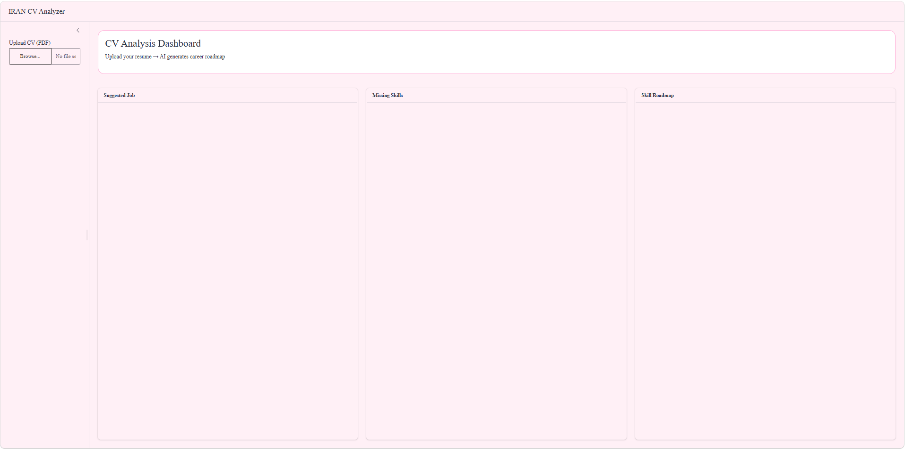

# 🇮🇷 IRAN CV Analyzer

Upload your resume → Get AI-powered career insights

---

## 🧠 Overview

IRAN CV Analyzer is a smart AI-powered Shiny application that analyzes resumes locally using **Ollama + Llama 3.2** and provides:

- Job role suggestions  
- Missing skills detection  
- Personalized career roadmap  

---

## 🛠 Built With

- R  
- Shiny  
- Ollama (Local LLM runtime)  
- Llama 3.2  

---

## ✨ Features

- 📄 Resume (PDF) upload  
- 🧠 AI-powered CV analysis  
- 🎯 Job recommendation system  
- 📉 Skill gap detection  
- 🗺 Career roadmap generation  
- 🔒 Fully local AI (no cloud API needed)

---

## 📊 Preview



---

## 🔌 Local AI Setup (Ollama)

This project runs fully locally using **Ollama**.

---

### 1. Install Ollama

Download and install from:

https://ollama.com

---

### 2. Pull the model

Open CMD (Run as Administrator) and run:

```bash
ollama --version
```
If Ollama is installed correctly, you will see the version number.
Then pull the model:
```bash
ollama pull llama3.2
```
Wait for the installation (about 1–5 minutes).then write:
```bash
ollama serve
```
Check if everything is working:
Open your browser and go to:

http://localhost:11434

If everything is correct, you will see:

"Ollama is running"

### 4.▶️ Run the App (R)

Install required packages:

install.packages(c("shiny", "httr", "jsonlite", "stringr"))

Run the application:

source("IRAN_CV.R")
⚠️ Important Flow

Make sure you follow this order:

Start Ollama (ollama serve)
Ensure model is downloaded (llama3.2)
Run the R Shiny app
Upload your CV in the interface
🚀 Result
After upload, the system generates:
Suggested job roles
Missing skill analysis
Career development roadmap
👉 For more details, watch the video on LinkedIn.
